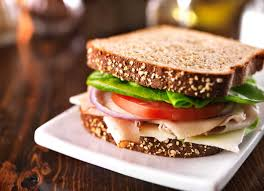

# How to build the **PERFECT** sandwish

1. Choose the Right `Bread`
The bread sets the foundation. Choose based on the sandwich style—sourdough, rye, ciabatta, brioche, multigrain, or baguette. Make sure it can hold your ingredients without falling apart. Toasting it slightly can add structure and crunch.

>***Tips*** *Choose the bread*: Use sturdy bread that can support your fillings without falling apart.

2. Pick a Spread or `Sauce`
Spreads provide flavor and moisture. Popular options include mayonnaise, mustard, aioli, or hummus. For more adventurous flavors, try pesto, chipotle mayo, sriracha, or olive tapenade. Spread all the way to the edges to seal the bread and prevent sogginess.

>***Tip*** *Add a spread*: Spread condiments evenly to the edges to boost flavor and prevent sogginess.

3. Add `Protein`
This is the heart of the sandwich. Good options include turkey, roast beef, ham, chicken, or prosciutto. For vegetarian options, try tuna salad, egg salad, tofu, tempeh, or falafel. Cheese can also count here—cheddar, Swiss, provolone, gouda, or blue cheese are all great choices.

>***Tip*** *Pick a protein*: Choose a protein that adds substance and complements the other ingredients.

4. Include `Vegetables` for Crunch and Freshness
Fresh veggies balance the richness of the protein. Use lettuce (like romaine or arugula), tomatoes, cucumbers, onions, and bell peppers. You can also add pickles, jalapeños, avocado, or sprouts for extra flavor and texture.

>***Tipe*** *Add vegetables*: Include fresh veggies for crunch, color, and balance.

5. Add a Final `Touch- Seasoning`
Seasonings can elevate your sandwich. A pinch of salt and pepper, a drizzle of olive oil or vinegar, or a squeeze of lemon juice can go a long way. Extra touches like a fried egg, crispy bacon, or caramelized onions add gourmet flair.
>***Tip*** Season it: Add salt, pepper, or a splash of acid to enhance and brighten flavors.

6. Cut and `Serve`
Cut the sandwich cleanly with a sharp knife. A diagonal cut often looks and feels better. Serve immediately while the textures and temperatures are at their best.
>***Tip*** *Cut and serve*: Use a sharp knife for a clean cut and serve immediately for best results.

For more info [Click here](https://www.wikihow.com/Make-a-Sandwich)

